# 📺 SocialTube Backend

 A feature-rich backend-powered video-sharing social media platform combining the best of YouTube and Twitter functionalities — built with **Node.js**, **Express**, and **MongoDB**.

 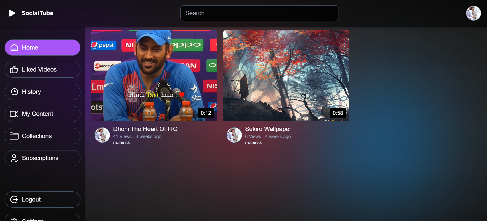

---

## 🌟 What is SocialTube?

**SocialTube** is a powerful application designed to support a modern social media experience. It provides APIs for handling video uploads, user authentication, tweets, subscriptions, playlists, comments, and analytics — all using a **RESTful** design approach. All this is coupled with a modern, smooth and sleek feeling UI Experience made with 
**React** + **Vite**, **React Router**, **Redux Toolkit**, **Tailwind** CSS, **Hot-toast** for notifications, **Framer Motion** for animations and transitions ✨.

 🔗 [Live (SocialTube)](https://social-tube-frontend.vercel.app)

 📁 [API Documentation](https://documenter.getpostman.com/view/43220209/2sAYkGJdwu)

 🧠 [Model Architecture](https://app.eraser.io/workspace/YtPqZ1VogxGy1jzIDkzj)

---

## 🚀 Key Features

### 👤 User Management
- Register, login, logout
- Profile updates (avatar, cover image)
- Watch history tracking <br>

 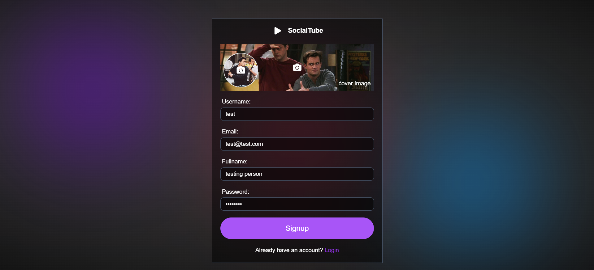<br>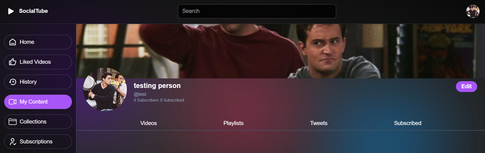<br> 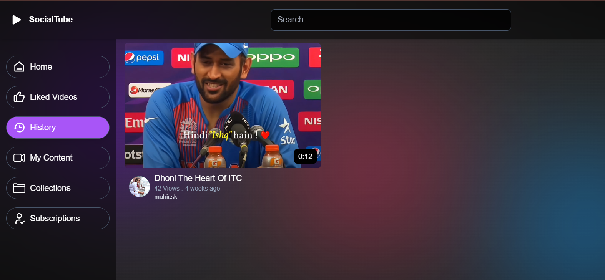 

### 📹 Video Management
- Upload, update, delete videos
- Publish/unpublish<br>

 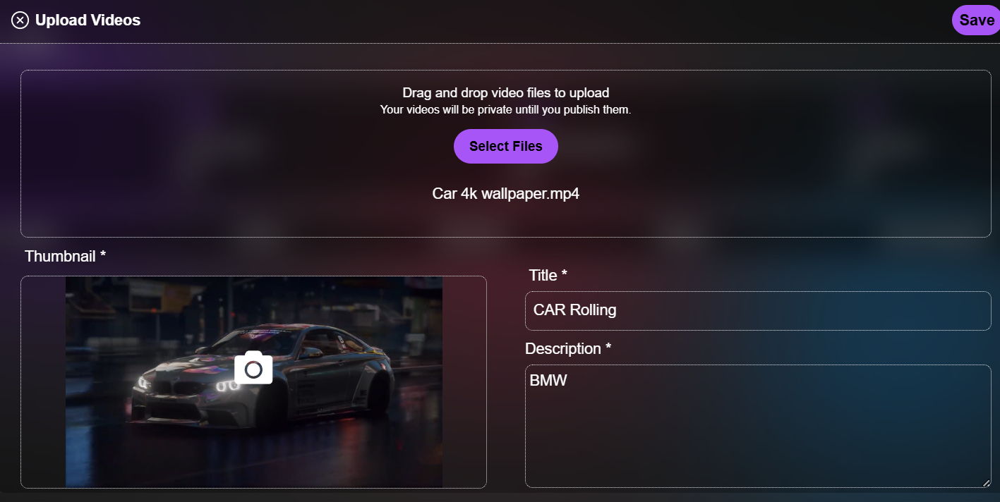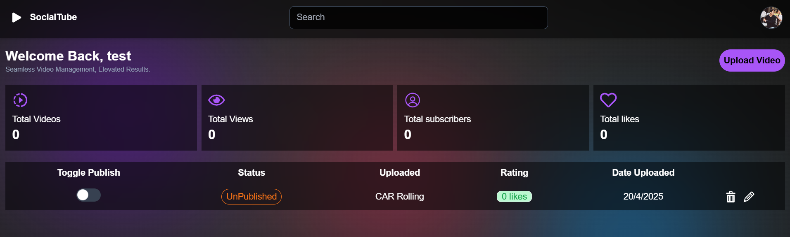

### 🦅 Tweet System
- Post, edit, and delete tweets
- Fetch tweets by user
 <br>

 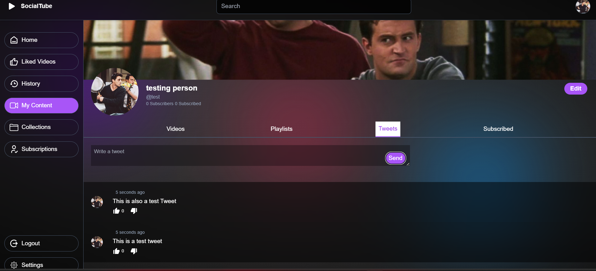

### 🔔 Subscriptions
- Subscribe/unsubscribe to users
- Access subscriber and subscription lists
 <br>

 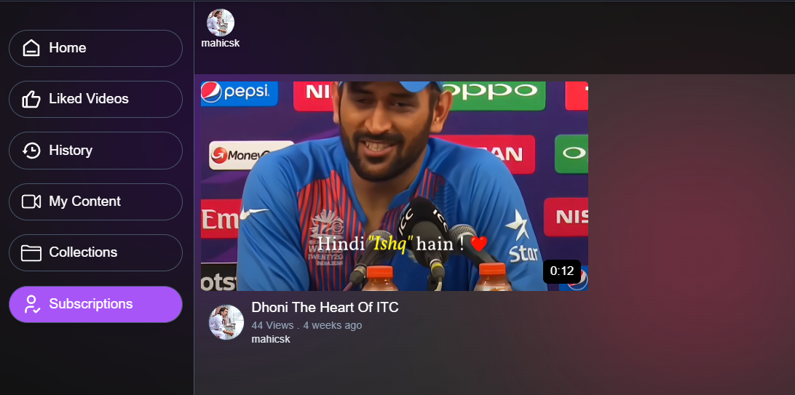

### 📂 Playlist Management
- Create, modify, delete playlists
- Add/remove videos from playlists
<br>

 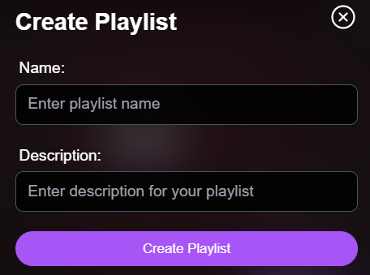
 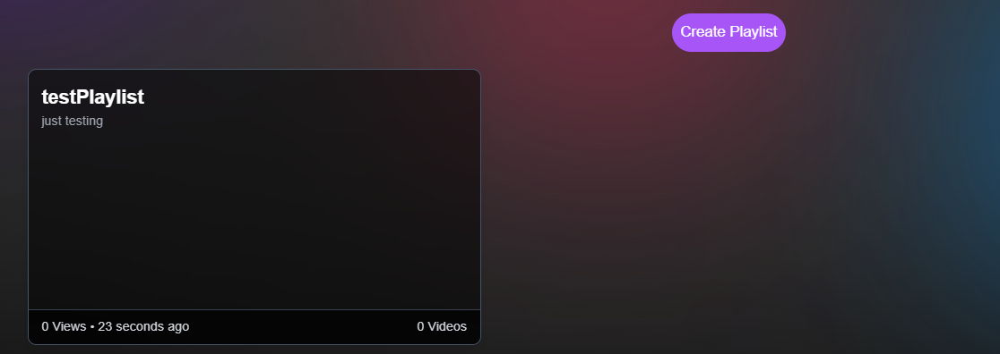

### 👍 Like & 💬 Commenting System
- Like/unlike videos, tweets, and comments
- Access liked content
- Full CRUD operations for video comments
<br>

 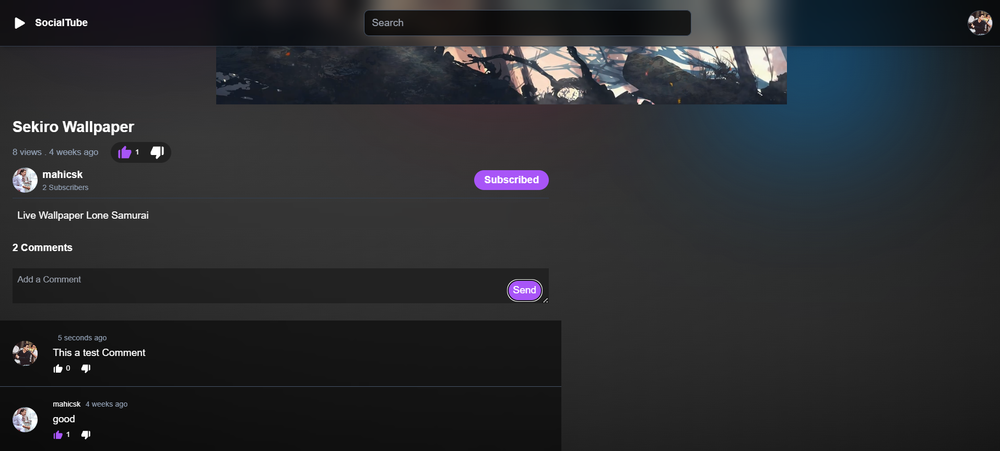

### 📊 Channel Dashboard
- View analytics: views, uploads, likes, and subscribers
- List all uploads
<br>

 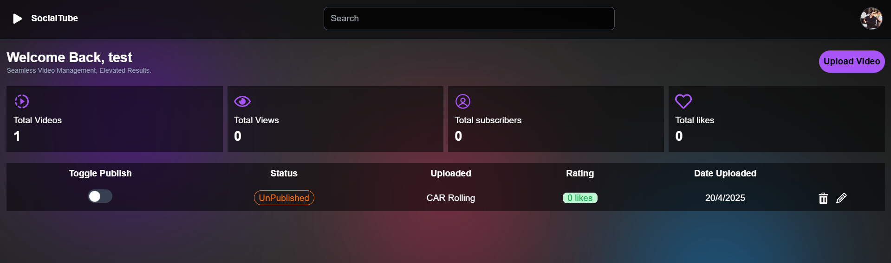

### ❤️ Health Check
- Pingable endpoint for service uptime validation <br>
[Ping](https://socialtube-backend.onrender.com/api/v1/healthcheck)
---

## 🎓 What I Learned
Post Learning Front-End Development in React and making 🔗 [FeatherBlogs)](https://social-tube-frontend.vercel.app) ,
this project was a significant step for me toward learning backend.

Developing SocialTube helped me gain a deep, practical understanding of backend development concepts. Here are some key lessons I took away:

- **Authentication & Authorization:** Mastered secure token-based auth using JWT, refresh tokens, and middleware for access control.
- **MongoDB Schema Design:** Learned how to design efficient schemas for complex use cases like subscriptions, playlists, and nested comments.
- **Media Handling:** Integrated Cloudinary for media uploads, handling large files, and building secure upload endpoints.
- **API Design & Structuring:** Employed RESTful principles, used controller-service architecture, and modularized the codebase effectively.
- **Performance Optimization:** Used MongoDB indexing, aggregation pipelines, and pagination for optimal performance at scale.
- **Security Best Practices:** Applied middleware like CORS, validated inputs, and protected routes and payloads.

This project was a significant step in strengthening my Node.js, Express, and MongoDB expertise, along with design and debugging skills.

---

## 🛠️ Tech Stack

| Layer        | Technology                 |
|--------------|-----------------------------|
| Runtime      | Node.js                     |
| Framework    | Express.js                  |
| Database     | MongoDB                     |
| Media Upload | Cloudinary                  |
| Auth         | JSON Web Tokens (JWT)       |
| Security     | Helmet, CORS                |
| Deployment   | Render, Vercel              |
| Frontend     | HTML, Tailwind, JSX,React   |

---

## 📁 Repository Setup

Follow these steps to run the backend locally,<br>
Refer To:- 📁 [API Documentation](https://documenter.getpostman.com/view/43220209/2sAYkGJdwu) (for streamlining your process)

```bash
# 1. Clone the repository
$ git clone https://github.com/Ayush-Raj-0304/socialTube-backend.git
$ cd socialTube-backend

# 2. Install dependencies
$ npm install

# 3. Create environment variables
$ cp .env.sample .env
# Edit .env file to include MongoDB URI, JWT secret, Cloudinary credentials, etc.

# 4. Start development server
$ npm run dev
```

> Server will start on `http://localhost:5000/` by default

---

## 📌 Project Highlights

- Clean modular controller-service-repository structure
- Centralized error handling and middleware
- Follows best practices for secure RESTful API development
- Easy to extend for more social features

---

## 📜 License & 🤝 Contribution

This project is open for contributions. Feel free to contribute and enhance its features!
---

## 💡 Final Note

SocialTube backend is a great starting point for building scalable, real-time media platforms. Feel free to fork and build your own version or integrate the APIs into your custom frontend!

Maintained by **Ayush Raj**  
[GitHub](https://github.com/Ayush-Raj-0304) | [LinkedIn](https://www.linkedin.com/in/ayush-raj-dev)
